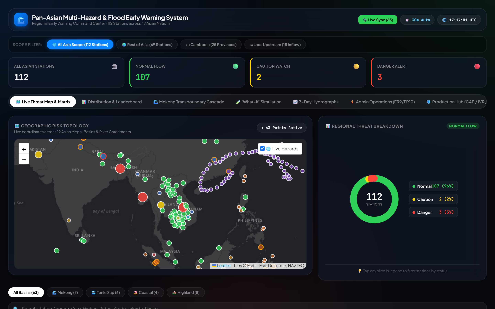
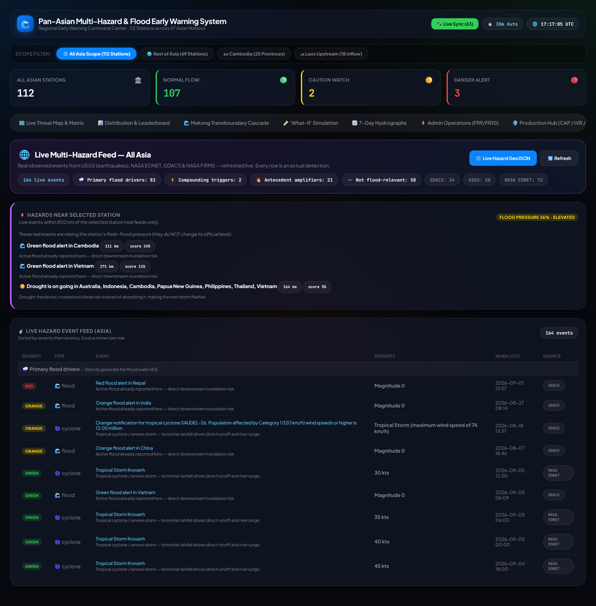
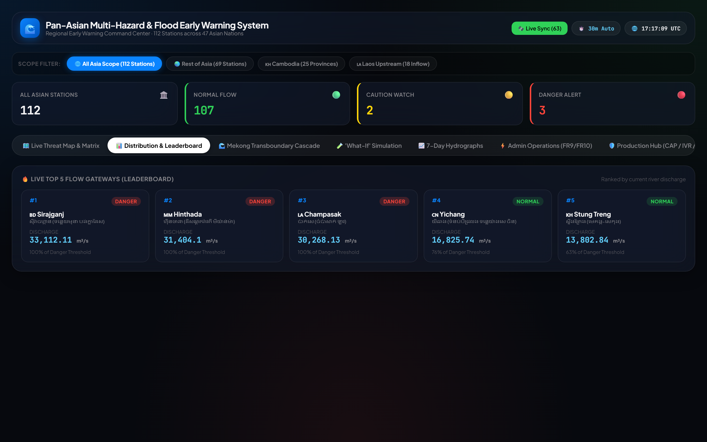
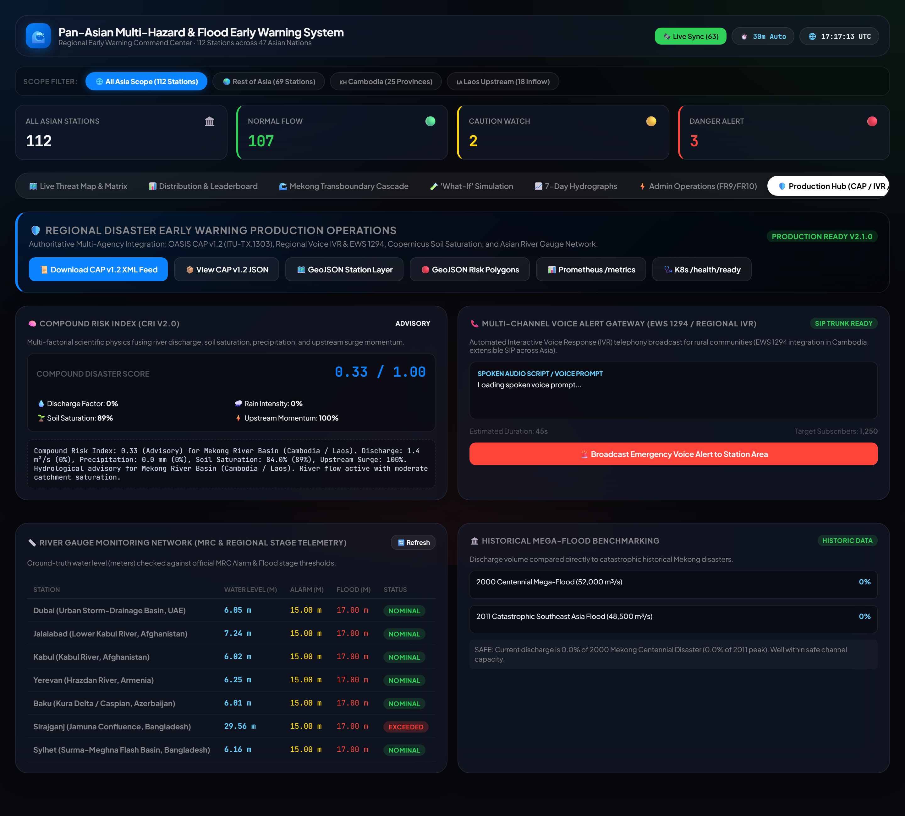

# Pan-Asian Multi-Hazard & Flash-Flood Early Warning Platform

CSCI 841 - Advanced Software Engineering  
Fort Hays State University (FHSU)  
Author: Oudom Thach

## Overview

The Pan-Asian Multi-Hazard & Flash-Flood Early Warning Platform is an enterprise hydrometeorological monitoring and emergency alert service. It ingests real-time river discharge, precipitation, and **live observed multi-hazard events** across **112 monitoring stations spanning 47 Asian countries** (25 Cambodian provinces, 18 upstream transboundary stations in Laos, and 69 stations across the rest of Asia — South, Southeast, East, Central, and Western Asia plus the Caucasus).

The system features **per-basin calibrated threshold profiles (`BASIN_PROFILES`)** so each river is judged on its own hydrology, a **flash-flood contribution model** that classifies every real hazard by how it drives flooding (primary driver / compounding trigger / antecedent amplifier / not relevant), serves an interactive Glassmorphism administrative command dashboard with a live hazard map overlay, exposes standard OASIS CAP v1.2 XML/JSON feeds, and broadcasts multi-channel alerts (Telegram, SMS, and EWS 1294 Voice IVR).

### Live hazard data sources (real, observed — no synthetic data)

- **USGS FDSN** — earthquakes (keyless)
- **NASA EONET v3** — tropical cyclones/severe storms, volcanoes, wildfires, floods, landslides, drought (keyless)
- **GDACS** — severity-graded (Green/Orange/Red) alerts across all hazard types (keyless)
- **NASA FIRMS** — satellite active-fire detections (optional free `FIRMS_MAP_KEY`)
- **Copernicus GloFAS / Open-Meteo** — river discharge & precipitation for all 112 stations

## Screenshots

| Command Dashboard | Live Multi-Hazard Feed |
|---|---|
|  |  |
| **Distribution & Leaderboard** | **Production Hub (CAP / IVR / GIS)** |
|  |  |

The live hazard feed groups every real event by its **flash-flood role** (primary driver /
compounding trigger / antecedent amplifier / not relevant) and shows a per-station **flood pressure**
with the mechanism behind each contributing event.

## Architecture

See **[docs/ARCHITECTURE.md](docs/ARCHITECTURE.md)** for the full system architecture, monitoring-cycle
sequence, live-hazard pipeline, domain-model UML, and the SQLite schema (all Mermaid diagrams).

## Monitored Stations (112 Stations Across 47 Countries)

- **Cambodia (25 Stations)**: All 25 provinces and municipalities, covering Mekong mainstem gauges (Kratie, Stung Treng, Kampong Cham), Tonle Sap basin (Phnom Penh, Siem Reap, Battambang, Kampong Chhnang, Pursat), and coastal/highland basins.
- **Laos Transboundary Corridors (18 Stations)**: Key upstream stations including Pakse (Champasak), Attapeu (Sekong), Vientiane, and Luang Prabang providing 24-72 hours of transboundary lead time.
- **Rest of Asia (69 Stations)**: Major rivers across South Asia (Ganges, Brahmaputra, Indus, Surma-Meghna, Himalayan gorges, Sri Lanka, Bhutan, Maldives, Afghanistan), Southeast Asia (Chao Phraya, Red River, Irrawaddy, Marikina, Ciliwung, Malaysia, Singapore, Brunei, Timor-Leste), East Asia (Yangtze, Lancang, Japan, Korea, Mongolia), Central Asia (Kazakhstan, Uzbekistan, Kyrgyzstan, Tajikistan, Turkmenistan), Western Asia/Middle East (Iran, Iraq, Türkiye, Levant, Arabian Peninsula), and the Caucasus + Cyprus. A few arid/atoll stations (e.g. Malé, Nukus) have no GloFAS river signal and appear without discharge.

## Project Structure

```
asia-flood-system/
├── asia_flood_core/          # Core application package
│   ├── __init__.py
│   ├── admin_server.py       # FastAPI application, command console, and GIS endpoints
│   ├── cap_protocol.py       # OASIS Common Alerting Protocol (CAP v1.2) XML/JSON engine
│   ├── data_intake.py        # Async multi-source intake (GloFAS, Weather, Soil Moisture, Gauges)
│   ├── live_hazards.py       # Real live hazard feeds (USGS, NASA EONET, GDACS, NASA FIRMS)
│   ├── flood_linkage.py      # Flash-flood contribution model (roles, scoring, station pressure)
│   ├── integration.py        # Pipeline orchestrator
│   ├── main.py               # CLI entrypoint (asia-flood)
│   ├── models.py             # Pydantic v2 data models (Reading, RiskState, HazardEvent, BasinProfiles)
│   ├── notifications.py      # Multi-channel alerts (Telegram, SMS, EWS1294 Voice IVR, Webhooks)
│   ├── rate_limiter.py       # Sliding-window rate limiter and per-user cooldowns
│   ├── risk_engine.py        # Per-basin threshold profiles (BASIN_PROFILES) & Compound Risk Engine
│   ├── run_demo.py           # Demonstration script
│   ├── storage.py            # SQLite WAL database (asia_flood.db), hot cache, and GIS export
│   └── telegram_bot.py       # Location-aware, hazard-aware Telegram bot
├── tests/                    # Test suite (47 unit, integration & multi-hazard tests)
│   ├── test_intake.py
│   ├── test_multi_hazard_expansion.py
│   ├── test_pipeline.py
│   ├── test_production_expansion.py
│   ├── test_rate_limiter.py
│   ├── test_risk_engine.py
│   └── test_storage_optimization.py
├── .env.example
├── .gitignore
├── Dockerfile
├── docker-compose.yml
├── pyproject.toml
├── requirements.txt
└── README.md
```

## Setup and Installation

### 1. Run the Application

#### Start the Production Gateway
```bash
uv run uvicorn asia_flood_core.admin_server:app --host 0.0.0.0 --port 8000
```

Once running, access:
- **National Command Console**: `http://localhost:8000/admin`
- **OASIS CAP v1.2 XML Feed**: `http://localhost:8000/api/cap/feed.xml`
- **Prometheus Metrics**: `http://localhost:8000/metrics`
- **Multi-Hazard GIS Grid**: `http://localhost:8000/api/gis/multi-hazard.geojson`
- **Swagger API Docs**: `http://localhost:8000/docs`

### 2. Run the Test Suite

Run the full automated test suite with pytest:

```bash
python -m pytest tests/ -v
```

All 47 automated tests pass. They validate:
- **Per-basin risk classification**: the same discharge yields different risk levels on different rivers (`BASIN_PROFILES`), so a small urban river and the Yangtze are judged on their own hydrology.
- **Live multi-hazard normalization**: USGS / EONET / GDACS / FIRMS events normalized into a single `HazardEvent` stream, de-duplicated, with an Asia geo-filter and graceful offline fallback.
- **Flash-flood contribution model**: hazard role classification (primary driver / compounding trigger / antecedent amplifier / not relevant) and per-station flash-flood pressure scoring.
- **Standardized Protocols**: OASIS CAP v1.2 XML/JSON schema compliance, Prometheus `/metrics`, and Kubernetes probes.
- **Hydrological Physics**: Copernicus volumetric soil moisture, Compound Risk Index, per-basin historical benchmarking, and MRC water stages.

## Production API Endpoints

| Method | Endpoint | Protocol / Standard | Description |
|---|---|---|---|
| GET | `/admin` | HTML5 / Glassmorphism | Real-time National Command Center dashboard |
| GET | `/health/live` | K8s Probe | Container liveness check |
| GET | `/health/ready` | K8s Probe | Database connectivity & cache readiness |
| GET | `/metrics` | Prometheus | Prometheus telemetry metrics (stations, alerts, discharge) |
| GET | `/api/cap/feed.xml` | OASIS CAP v1.2 / ITU-T X.1303 | Standard XML emergency alert broadcast feed |
| GET | `/api/cap/feed.json` | OASIS CAP v1.2 | JSON representation of emergency alert feed |
| GET | `/api/gis/stations.geojson` | RFC 7946 GeoJSON | Point FeatureCollection for ArcGIS, QGIS, or Leaflet |
| GET | `/api/gis/risk-heatmap.geojson`| RFC 7946 GeoJSON | Polygon buffer hazard zones around active threats |
| GET | `/api/gis/multi-hazard.geojson` | RFC 7946 GeoJSON | Alias of the live hazard GeoJSON (real feeds only) |
| GET | `/api/hazards/live.geojson` | USGS / EONET / GDACS / FIRMS | Unified live hazard events across Asia (real observed detections) |
| GET | `/api/hazards/feed` | Aggregated live feed | Live hazards as JSON, sorted by severity, with per-type/per-source counts |
| GET | `/api/hazards/earthquakes` | USGS + GDACS | Live earthquakes across Asia (kept for backward compatibility) |
| GET | `/api/hazards/cascading-matrix` | Flash-Flood Contribution Model | Per-station flash-flood pressure + contributing hazards grouped by role |
| GET | `/api/analytics/compound-risk` | Proprietary CRI v2.0 | Multi-factor physics breakdown (Discharge, Soil, Rain, Surge) |
| GET | `/api/analytics/historical-compare` | Benchmarking | Crest percentage vs historic 2000, 2011, 2020 mega-floods |
| GET | `/api/analytics/transboundary-surge`| Kinematic Routing | Laos-to-Cambodia surge momentum & lead-time hours |
| GET | `/api/telemetry/mrc-gauges` | MRC Standards | Calibrated river levels (m) vs official MRC flood stages |
| POST| `/api/dispatch/voice-ivr` | Cambodia EWS 1294 | Stages automated bilingual voice call broadcast |

