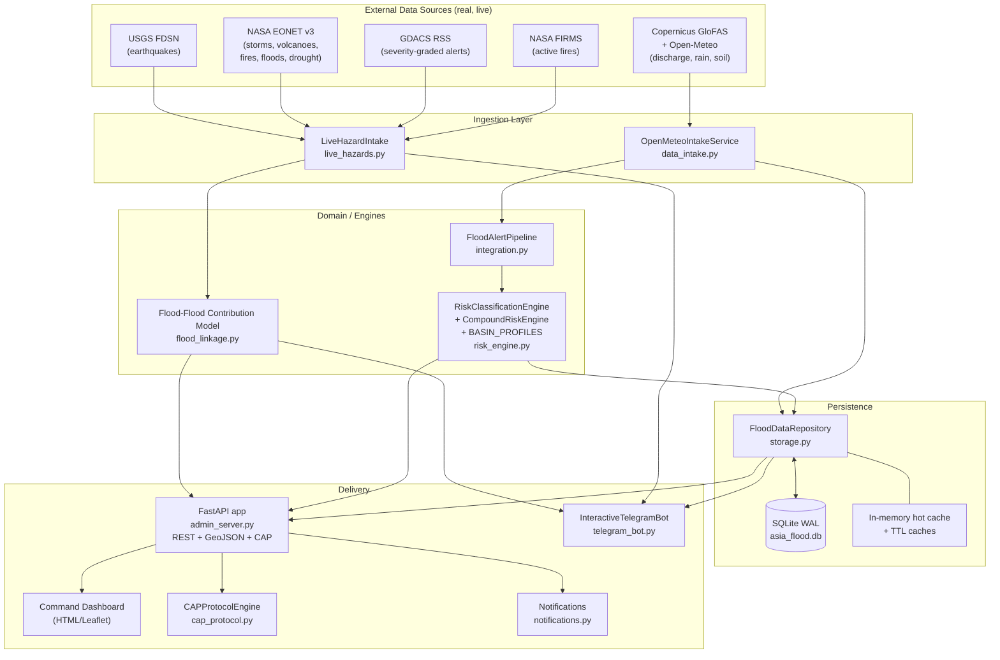
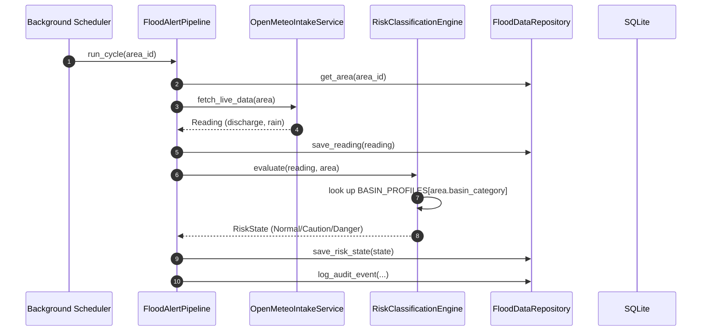
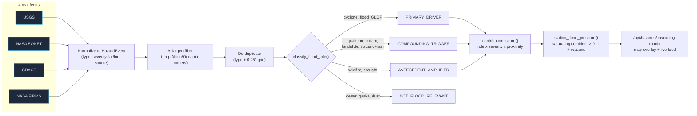
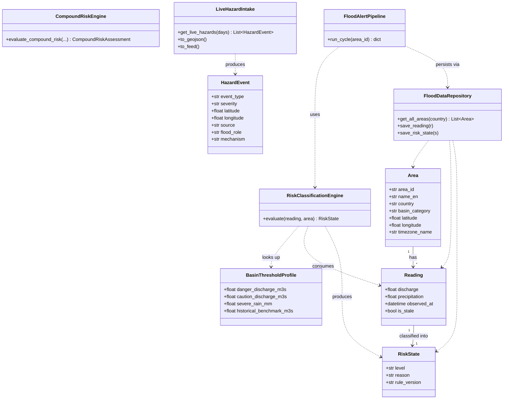
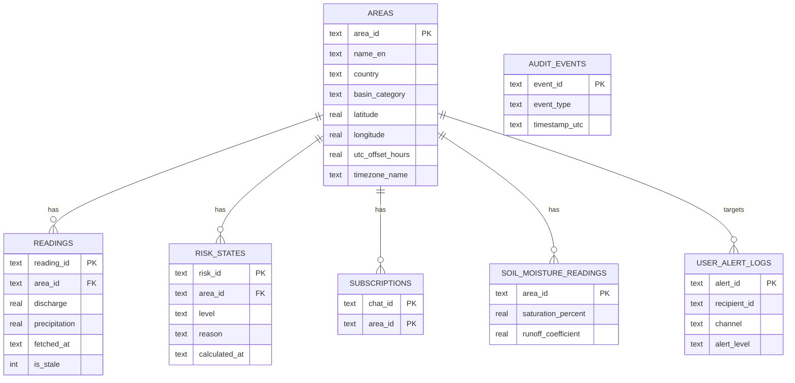

# Architecture & Design

Pan-Asian Multi-Hazard & Flash-Flood Early Warning Platform
CSCI 841 — Advanced Software Engineering, Fort Hays State University · Author: Oudom Thach

This document describes the system architecture, data flow, domain model, and the
flash-flood contribution model. All diagrams are [Mermaid](https://mermaid.js.org/) and
render directly on GitHub.

---

## 1. System Architecture (containers & components)



---

## 2. Monitoring Cycle (sequence)

Every station is polled on a schedule; readings are classified per basin and persisted.



---

## 3. Live Hazard Pipeline & Flash-Flood Contribution Model

Real hazards are fused, de-duplicated, then judged by **how they contribute to a flash flood** —
never overriding the hydrological risk level, only annotating a transparent "flood pressure".



---

## 4. Domain Model (key classes)



---

## 5. Persistence Schema (SQLite)



---

## 6. Design Principles

- **Per-basin correctness** — one global threshold cannot serve both a small urban river and the
  Yangtze, so risk is evaluated against `BASIN_PROFILES` keyed on each station's `basin_category`.
- **Real data, honestly labeled** — the hazard layer carries only observed detections; every event
  shows its source (USGS / EONET / GDACS / FIRMS).
- **No false panic** — indirect hazards raise a transparent *flood pressure* with reasons but never
  auto-escalate the discharge/rain-driven Normal/Caution/Danger level.
- **Fail soft** — external feeds are TTL-cached and isolated; one outage never breaks the page.
- **Auditable** — every evaluation and alert dispatch is logged with UTC + local timestamps.
```
